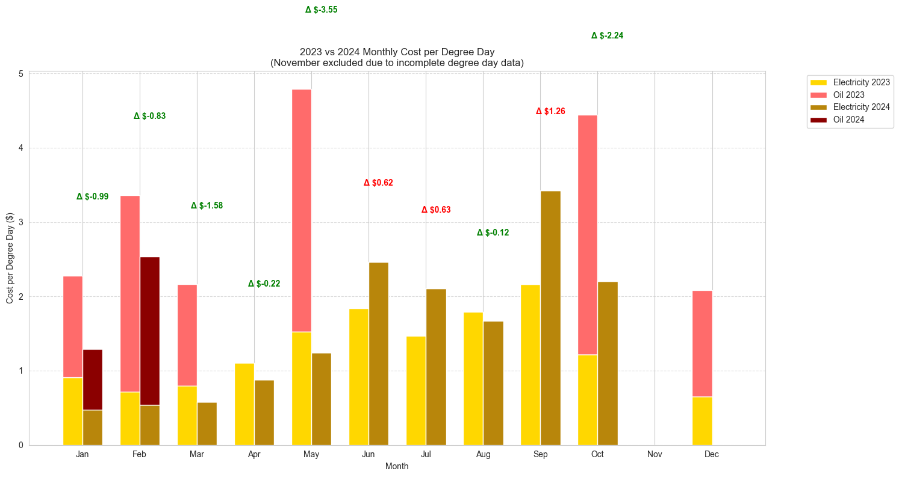

# Utility Analysis

A tool for analyzing and visualizing utility costs over time.



## Setup

### Project Setup

Install Python and dependencies using mise and poetry:
```bash
mise install
poetry install
poetry run pytest
```

## Usage

1. Place your utility cost data in `data/utility_costs.csv` with the following format:

```csv
date,electricity_cost,oil_cost
2022-01-01,145.50,250.75
2022-02-01,132.25,225.50
```

2. Run the analysis:
```bash
poetry run ua
```

The script will generate two visualization files in the `output` directory:
- `electricity_comparison.png`
- `oil_comparison.png`

## Verify Installation

Run the test suite to verify everything is working correctly:
```bash
poetry run pytest
```

This will run a simple test that generates visualizations using sample data. If successful, you'll see test output and sample charts in the `output` directory.

### Prerequisites

1. Install [mise](https://mise.jdx.dev/getting-started.html) for managing Python versions:

```bash
curl https://mise.run | sh
```

2. Install Poetry for dependency management:

```bash
curl -sSL https://install.python-poetry.org | python3 -
```

## Data Structure

```
data/
├── raw/              # Source data files
│   ├── electric_raw.csv
│   └── oil_raw.csv
├── processed/        # Generated data files
│   ├── utility_costs.csv
│   ├── electric_rates.csv
│   └── oil_rates.csv
└── electric_bills/   # PDF bills for processing
```

## Data Processing

1. Place your raw data files in the `data/raw` directory:
   - `electric_raw.csv`: Electric bill data with columns: date, amount, kwh_used
   - `oil_raw.csv`: Oil delivery data with columns: date, amount, gallons

2. Process the raw data:
```bash
poetry run process
```

This will create processed data files in the `data/processed` directory.

## PDF Bill Processing - Under Development

To extract data from PDF bills:

1. Place your electric bill PDFs in `data/electric_bills/`
2. Create a `.env` file with your OpenAI API key:
```
OPENAI_API_KEY=your_api_key_here
```

3. Run the extraction:
```bash
poetry run extract
```

This will create `electric_raw.csv` from your PDF bills.

## Weather Data Integration

To fetch weather data for analysis:

1. Create a `config.json` file with your location:
```json
{
    "latitude": 42.3601,
    "longitude": -71.0589,
    "base_temp_c": 18.0
}
```

2. Run the weather data fetcher:
```bash
poetry run weather
```

This will create `weather_data.csv` in the processed directory with:
- Average, min, and max temperatures
- Precipitation and snow data
- Heating Degree Days (HDD)
- Cooling Degree Days (CDD)

The data is automatically aligned with your utility cost date range.

## Quick Update Guide

When you have new utility data:

1. Update raw data files:
   - Add new electric bills to `data/raw/electric_raw.csv`
   - Add new oil bills to `data/raw/oil_raw.csv`

2. Run scripts in this order:
```bash
poetry run process    # Convert raw data to utility_costs.csv
poetry run weather    # Update weather data for new date range
poetry run efficiency # Calculate efficiency metrics
poetry run analyze    # Generate efficiency comparison graphs
poetry run savings    # Generate savings analysis vs previous year
```

All outputs will be in the `output/` directory:
- `utility_comparison.png`: Monthly cost breakdown
- `efficiency_comparison.png`: Cost per degree day analysis
- `savings_analysis.png`: Year-over-year savings comparison
- `efficiency_summary.csv`: Yearly statistics
- `monthly_savings.csv`: Detailed monthly savings data